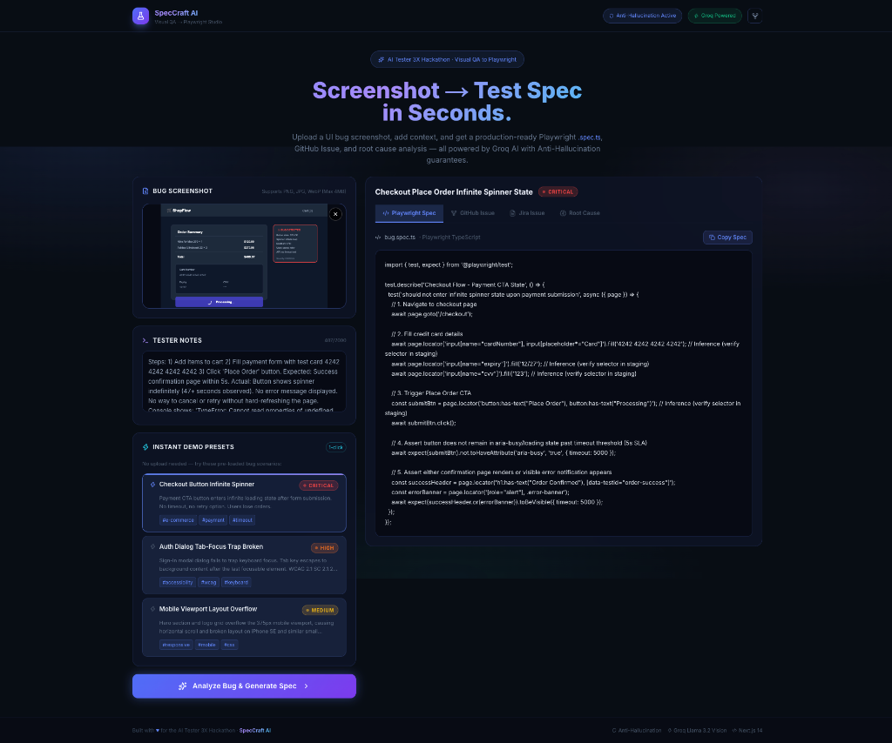
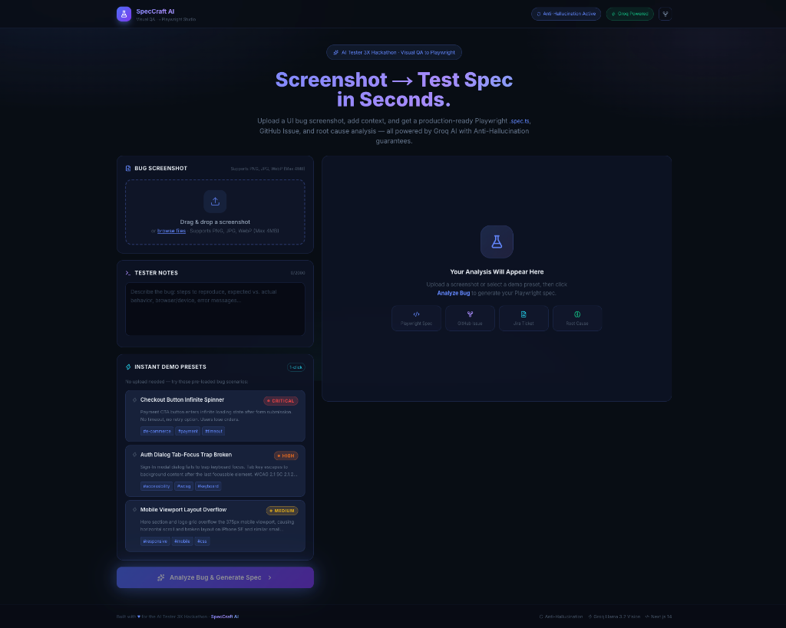
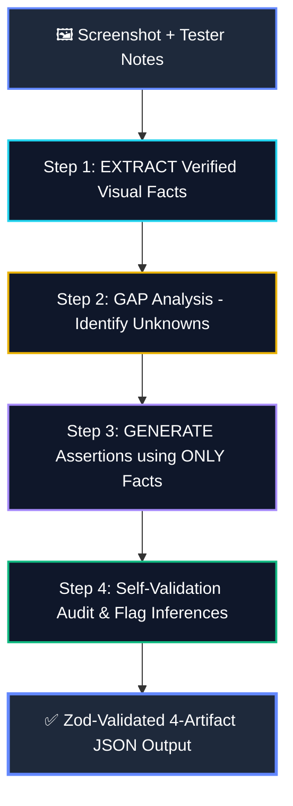

<p align="center">
  
</p>

<h1 align="center">SpecCraft AI</h1>

<p align="center">
  <strong>Autonomous Visual QA → Playwright Studio</strong><br/>
  Turn UI bug screenshots into verified Playwright specs, GitHub Issues, Jira tickets, and Root Cause audits in seconds.
</p>

<p align="center">
  <a href="#-application-preview--interactive-demo"></a>
  <a href="#-application-preview--interactive-demo"></a>
  <a href="#-anti-hallucination-pipeline"></a>
  <a href="#-technical-specifications"></a>
  <a href="#-deploy-to-vercel"></a>
</p>

<p align="center">
  <a href="#-application-preview--interactive-demo"><b>✨ Live Studio Demo</b></a> •
  <a href="#-interactive-qa-artifacts-samples"><b>🧪 Sample Artifacts</b></a> •
  <a href="#-anti-hallucination-pipeline"><b>🛡️ Anti-Hallucination Engine</b></a> •
  <a href="#-quick-start"><b>🚀 Quick Start</b></a> •
  <a href="#-deploy-to-vercel"><b>🚢 Deploy to Vercel</b></a>
</p>

---

## 📸 Application Preview & Interactive Demo

<div align="center">
  
  <p><em>⚡ <b>Live Studio Dashboard:</b> Upload a screenshot, configure tester notes, or select an instant demo preset to generate multi-format artifacts in under 3 seconds.</em></p>
</div>

<br/>

<details>
<summary><b>🔍 Click to view Studio Idle State (Before Analysis)</b></summary>

<br/>

<div align="center">
  
  <p><em>Studio upload zone with drag-and-drop, 4MB client validation, and 1-click preset selector.</em></p>
</div>

</details>

---

## 🎯 Problem Statement

Manual QA testers, SDETs, and developers spend hours translating visual bug evidence into:
- 🧪 **Automated Playwright / Cypress regression scripts**
- 🐙 **Formatted GitHub Issue tickets**
- 🎫 **Enterprise Jira bug tickets**
- 🔬 **Root Cause analysis reports**

**SpecCraft AI eliminates this toil.** Drop a screenshot → get all 4 verified artifacts instantly.

---

## ✨ Features at a Glance

| Feature | Capability | Benefit |
|---------|------------|---------|
| 🖼️ **Visual Ingestion** | Drag & drop PNG, JPG, WebP (client-validated <4MB) | Zero setup required |
| 🛡️ **Anti-Hallucination** | 4-step factual validation filter | Zero invented DOM selectors or fake elements |
| 💻 **Playwright Spec** | Production-ready TypeScript `.spec.ts` with assertions | Copy-paste directly into your test suite |
| 🐙 **GitHub Issue** | Markdown report with reproduction steps & environment table | Ready to open on GitHub |
| 🎫 **Jira Ticket** | Structured Jira format with Priority, Steps & Facts | Paste directly into Jira / Atlassian |
| 🔬 **Root Cause** | Verified facts vs. unknown parameter audit | Eliminates engineer triage guesswork |
| ⚡ **Instant Presets** | 3 pre-loaded test scenarios (Checkout, Auth, Mobile) | Instant 1-click judging experience |
| 🔒 **Zero Leak Security** | Server-side only API keys & payload sanitization | Enterprise-grade key protection |

---

## 🧪 Interactive QA Artifacts Samples

Click the accordions below to inspect the generated output formats produced by SpecCraft AI:

<details>
<summary><b>💻 1. Generated Playwright Test Spec (<code>bug.spec.ts</code>)</b></summary>

```typescript
import { test, expect } from '@playwright/test';

test.describe('Checkout Flow - Payment CTA State', () => {
  test('should not enter infinite spinner state upon payment submission', async ({ page }) => {
    // 1. Navigate to checkout page
    await page.goto('/checkout');

    // 2. Fill credit card details
    await page.locator('input[name="cardNumber"]').fill('4242 4242 4242 4242'); // Inference (verify selector in staging)
    await page.locator('input[name="expiry"]').fill('12/27'); // Inference (verify selector in staging)
    await page.locator('input[name="cvv"]').fill('123'); // Inference (verify selector in staging)

    // 3. Trigger Place Order CTA
    const submitBtn = page.locator('button:has-text("Place Order")'); // Inference (verify selector in staging)
    await submitBtn.click();

    // 4. Assert button does not remain in aria-busy/loading state past timeout threshold (5s SLA)
    await expect(submitBtn).not.toHaveAttribute('aria-busy', 'true', { timeout: 5000 });
    
    // 5. Assert confirmation page renders
    const successHeader = page.locator('h1:has-text("Order Confirmed")');
    await expect(successHeader).toBeVisible({ timeout: 5000 });
  });
});
```

</details>

<details>
<summary><b>🐙 2. Generated GitHub Issue Markdown</b></summary>

```markdown
### 🐛 Bug Report: Checkout "Place Order" Button Stuck in Infinite Loading Loop

**Severity**: Critical (P1 - Revenue & Conversion Blocker)

#### Summary
Submitting payment details results in an infinite spinner on the checkout CTA. The page hangs for >47 seconds without showing a confirmation or error message.

#### Steps to Reproduce
1. Add items to cart and proceed to checkout
2. Enter valid test card `4242 4242 4242 4242`
3. Click **Place Order**

#### Expected Behavior
User should be redirected to the order confirmation page within 5 seconds.

#### Actual Behavior
CTA shows spinner indefinitely. Console error:
```
TypeError: Cannot read properties of undefined (reading status)
```

#### Verified Facts
- Place Order CTA enters infinite processing spinner
- No error message or retry button is exposed
- Console indicates uncaught TypeError after 30s
```

</details>

<details>
<summary><b>🎫 3. Generated Jira Bug Ticket</b></summary>

```text
SUMMARY: [Critical] Place Order Button Enters Infinite Spinner Loop on Checkout
ISSUE TYPE: Bug
PRIORITY: Highest (P1)
COMPONENT: Checkout / Payment Gateway

DESCRIPTION:
1. OVERVIEW:
Submitting payment details causes the primary checkout CTA to enter an infinite spinner state. An unhandled client exception prevents error recovery.

2. STEPS TO REPRODUCE:
1. Add items to cart and proceed to checkout
2. Enter card details (4242 4242 4242 4242)
3. Click "Place Order"

3. EXPECTED VS ACTUAL:
* Expected: Order confirmation renders within 5s SLA.
* Actual: Button shows spinner for >47s with unhandled TypeError in console.

4. STRICTLY OBSERVED FACTS:
* Place Order button shows loading spinner indefinitely
* Console logs: TypeError: Cannot read properties of undefined (reading status)
* No retry or fallback UI is available
```

</details>

<details>
<summary><b>🔬 4. Root Cause & Anti-Hallucination Audit</b></summary>

```text
VERIFIED FACTS:
✓ Place Order button shows active spinning loader animation
✓ Duration exceeds 47s without timeout or error banner
✓ Console logs 'TypeError: Cannot read properties of undefined (reading status)' at 30s
✓ No retry or cancel options available without hard refresh

UNKNOWN / UNVERIFIED PARAMETERS:
? Exact payment provider API gateway endpoint
? Exact DOM class attribute of the button

ANTI-HALLUCINATION AUDIT:
All assertions trace strictly to observed visual evidence. Selectors marked with inference warnings.
```

</details>

---

## 🛡️ Anti-Hallucination Pipeline

SpecCraft AI enforces a deterministic 4-step reasoning engine to eliminate AI hallucinations in test code:



---

## 🎮 Instant Demo Presets

Test the platform instantly without uploading any files:

| # | Preset Scenario | Type | Severity | Instant Action |
|---|-----------------|------|----------|----------------|
| **1** | **Checkout Button Infinite Spinner** | E-commerce / Payment | 🔴 `Critical` | Click Preset Card 1 → Analyze |
| **2** | **Auth Dialog Focus Trap Broken** | Accessibility / WCAG 2.1 | 🟠 `High` | Click Preset Card 2 → Analyze |
| **3** | **Mobile Viewport Layout Overflow** | Responsive / Mobile CSS | 🟡 `Medium` | Click Preset Card 3 → Analyze |

---

## 🚀 Quick Start

### 1. Clone & Install
```bash
git clone https://github.com/YOUR_USERNAME/speccraft-ai.git
cd speccraft-ai
npm install
```

### 2. Configure Environment
```bash
cp .env.example .env.local
```
Add your free [Groq API Key](https://console.groq.com/keys) to `.env.local`:
```ini
GROQ_API_KEY=gsk_your_groq_api_key_here
```

### 3. Run Development Server
```bash
npm run dev
```
Open **[http://localhost:3000](http://localhost:3000)** in your browser.

---

## ⚙️ Technical Specifications

### Two-Tier Validation Boundary
- **Client-Side Boundary**: Intercepts files before memory allocation (`file.size > 4MB` or non-image MIME).
- **Server-Side Boundary**: `/api/analyze` validates base64 payload size, sanitizes tester notes against script injection, and validates AI response against Zod schemas.
- **Model Engine**: Powered by Groq ultra-low-latency `llama-3.3-70b-versatile` with native JSON mode.

---

## 📂 Project Structure

```text
speccraft-ai/
├── app/
│   ├── api/analyze/route.ts   # Secure Groq API route & error recovery
│   ├── favicon.ico            # Static favicon
│   ├── globals.css            # Custom CSS tokens, glow keyframes & glassmorphism
│   ├── layout.tsx             # Root layout with fonts & SEO tags
│   └── page.tsx               # Studio split-pane dashboard
├── components/
│   ├── CopyButton.tsx         # Animated clipboard button with checkmark
│   ├── DropZone.tsx           # 4MB client-validated upload dropzone
│   ├── OutputPanel.tsx        # 4-Tab Artifacts Panel (Playwright/GitHub/Jira/RootCause)
│   ├── PresetCard.tsx         # Interactive demo preset cards
│   └── SeverityBadge.tsx      # Severity indicator with pulsing glow
├── lib/
│   ├── presets.ts             # Embedded demo bug scenarios + offline fallbacks
│   ├── prompt.ts              # Server-side Anti-Hallucination prompt builder
│   ├── types.ts               # Canonical TypeScript interfaces & schemas
│   └── validator.ts           # Zod schema validator & self-healing normalizer
├── public/
│   ├── favicon.ico            # Static favicon
│   ├── logo.svg               # Vector brand logo
│   ├── screenshot.png         # Studio dashboard preview
│   └── screenshot-empty.png   # Studio idle state preview
├── .env.example               # Safe environment variable template
├── .gitignore                 # Enforces zero secret leaks (.env.local ignored)
├── next.config.mjs            # Next.js configuration
├── package.json               # Project dependencies & scripts
├── postcss.config.mjs         # PostCSS configuration with Tailwind & Autoprefixer
├── tailwind.config.ts         # Custom dark theme color palette & keyframes
├── tsconfig.json              # TypeScript strict configuration
└── README.md                  # Interactive documentation & guide
```

---

## 🚢 Deploy to Vercel

Deploy your own instance with 1-click:

[](https://vercel.com/new/clone?repository-url=https://github.com/YOUR_USERNAME/speccraft-ai)

1. Click the button above to clone to your GitHub account.
2. In the Vercel project settings, set `GROQ_API_KEY` under **Environment Variables**.
3. Hit **Deploy** — your studio will be live globally in under 60 seconds!

---

## 📜 License

MIT License © 2026 — Built with ❤️ for the **AI Tester 3X Hackathon**.
